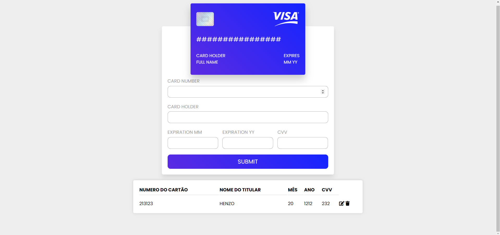

# Card Registration with CRUD 🚀🚀

## Summary 
#### This website was developed using HTML5, CSS, and JavaScript. The project aims to allow users to register bank cards and view the inserted data, with functionalities to remove or edit the registered card information.

## Why develop this Project ? 
#### This project was proposed by my Computer Science professor to put into practice concepts learned in class, such as HTTP requests, frontend-backend communication, and CRUD operations.

## How was this website developed ?
### FrontEnd 
#### The frontend design was inspired by a video from the YouTube channel Mr. Web Designer. I made some modifications, such as changing the colors, widths, and heights, and added a dynamic table at the bottom of the page.
#### The key feature of the frontend is its function for communicating with the backend, handling HTTP requests. These requests are made through the  `LoadCards()`  function.
### Backend  
#### For the backend, I am using Node.js libraries like Express, MySQL, and Cors to manage operations and database communication. Application endpoints are created through object methods such as `app.get()`.
### Endpoints CRUD
- ### Create - Insert card
- ### Read - Check card
- ### Update - Update  Card
- ### Delete - Delete card