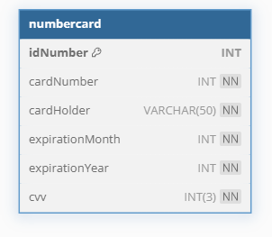

# 📦 Crud com Cadastro de Cartão 


## 💻 Aplicação CRUD 
Aplicação full-stack simples para demonstrar os conceitos básicos de CRUD (Create, Read, Update, Delete) de forma visual e didática. Utiliza banco de dados relacional para armazenar os dados dos cartões cadastrados.

## 🎯 Objetivo do Projeto
Este projeto foi uma proposta da disciplina Desenvolvimento Web, do curso de Ciência da Computação, com o objetivo de aplicar na prática os seguintes conceitos:

- 🔁 Requisições HTTP (GET, POST, PUT, DELETE)

- 🔗 Comunicação entre front-end e back-end

- 🗃️ Integração com banco de dados relacional

Com esta aplicação, é possível:

- 📋 Listar todos cartões

- 📌 Cadastrar um novo cartão

- 📝 Atualizar os dados de um cartão

- 🗑️  Deletar um cartão específico


## 🧠 Sobre a Modelagem


A modelagem foi pensada para facilitar a compreensão do funcionamento básico de um CRUD. Ela permite a inserção simples de dados, **sem foco em validações ou restrições complexas**.

## 📂 Estrutura do Projeto
Projeto desenvolvido com foco no aprendizado e aplicação de conceitos full-stack:
```
├── backend
│    ├── app.js                 # Arquivo principal do backend
│    ├── node_modules           # Diretório das dependências instaladas 
│    ├── package.json           # Configuração de dependências e scripts do projeto
│    ├── package-lock.json      # Controle de versões exatas das dependências
│ 
├── frontend 
│   ├── image                   # Imagens utilizadas na aplicação
│   ├── index.html              # Estrutura principal da página
│   ├── style.css               # Estilização da interface
│   ├── script.js               # Lógica da aplicação
│ 
├── image                       # imagem da documentação
├── mysql.sql                   # Script de modelagem do banco de dados MySQL
├── README.md                   # Documentação do projeto
```
 
#### ⚠️ Atualmente, a execução local do projeto não está disponível.

### 🛠  Tecnologias Utilizadas
### 💻 Backend

- **Node.js**

- **Express.js**

- **MYSQL**

### 🌍 Deploy e Hospedagem

- **Render**
- **Railway**